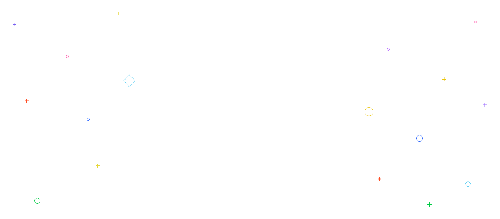

<h1 stlye="position: absolute; left: 45%; margin-top: 140px !important; z-index: 5;">
	Frontized™
</h1>

<div style="position:relative; height:280px; margin-bottom:30px">




### Frontend Starter kit with useful additional CSS and JS Scripts
I realised I was doing the same thing over and over when starting a new build so decided to create my own mini package which has the basics for starting a simple static or dynamic web site.
#### The first version of Frontized, (at that time named Bootstrap Extended, later referred to as Frontized) made its debut on Sep 10, 2015.

**NOTE** that this package has a dependency [Bootstrap 3.1](https://github.com/twbs/bootstrap) which already  installed as well.

Useful libraries and codes for [OneBrand™ Frontend Preview](http://gmkhussain.github.io/frontend/)
##### 1+1=3? : everything and takes it to a whole new level.

### ⌘ GH-Pages {ㅤ ㅤ ㅤㅤ ㅤ ㅤ ㅤㅤ}

</div>

### Versions

| Versions_History          | Notes      |           |
|------------------|---------------------|--------------|
| Frontized        |  Why Skip Version 1? Startup as a Bootstrap Extended |    |
| Frontized 2     | "Frontized" without the "Extended" referring to versions 2 and up.  |    |
| Frontized 4     |  Frontized 3 happened, but it was never released as stable, Skipping 3 to avoid a confusion due to the missmatch of the BS version which was already used in v2  |    |
<!--| Frontized 5     |   |    |
| Frontized 5.5     |   |    |
| Frontized 6 MX     |   |    |
| Frontized 7     |   |    |
| Frontized 8 Pro    |   |    |
| Frontized 8.1    |   |    |
| Frontized X     |  There no 9 because... Seven ate Nine. * CLEVER AND SUBTLE MARKETING TRICK:   simply going to call it the Frontized X and not pronounce it as Frontized Ten.

Didn’t skip 9, Just made a creative name for 10th anniversary.
 |    |-->


<table>
  <tr>
	<td>
		<a href="#Sass">
			
			<br/>
			Sass / SCSS
		</a>
	</td>
  	<td>
		<a href="#VanillaJS">			
  	
	    <br/>
	    Vanilla JavaScript
		</a>
	</td>	
	<td>
		<a href="#jQuery">
			
			<br/>
			jQuery
		</a>
	</td>	

	<td>
		<a href="#jQueryUI">
			
			<br/>
			jQuery UI
		</a>
	</td>
	<td>
		<a href="#Ajax">
			
			<br/>
			Ajax
		</a>
	</td>
  </tr>
  <tr>
	<td>
		<a href="#Swiper">
			
			<br/>
			Swiper
		</a>
	</td>
	<td>
		<a href="#DataTable">
			
			<br/>
			DataTable
		</a>
	</td>
	<td>
	
	<br/>
	Bootstrap Validator
	</td>
  </tr>
  <tr>
	<td>
		<a href="#git">
			
			<br/>
			Git / Tortoisegit
		</a>
	</td>
	<td>
		<a href="#npmScripts">
			
			<br/>
			NPM Scripts
		</a>
	</td>
  </tr>
  <tr>
	<td>
    <a href="#Resources">
    <br/>
    Resources</a>
	</td>
  </tr>
  <tr>
	<td>
		<a href="#Errors">
			
			<br/>
			Issues
		</a>
	</td>
  </tr>
</table>


<h1 align="center" id="ide">
	
	<br/>
	Folder structure
</h1>


## Folder structure 
Folder structure standard conventions varies by build system and programming language.

#### src/: 
"source" files to build and develop the project. This is where the original source files are located, before being compiled into fewer files to dist/, public/ or build/.

NOTE: The advantage on using partials is that you can use many files to organize your code and everything will be compiled on a single file. see SCSS folder for understanding


#### dist/: = Assets folder
"distribution", the compiled code/library, also named public/ or build/. The files meant for production or public use are usually located here.

#### lib/:
external dependencies (when included directly).

#### test/:
the project's tests scripts, mocks, etc.

#### vendor/:
dependencies are usually put here via dependency management.

#### bin/:
files that get added to your PATH when installed.


#### package.json:
describes library and dependencies (if a JS package).

#### composer.json:
same as above but for PHP packages via composer.

#### .travis.yml:
config file for the Travis CI environment.

#### .gitignore:
Specification of the files meant to be ignored by Git.


```html
<Root>
|   gulpfile.js
|   index.html
|   package.json
|   
+---src
|   +---css
|   |       bootstrap.min.css
|   |       stylized.css
|   |       
|   +---images
|   |   |   contact-area-bg.jpg
|   |   |   slide1.jpg
|   |   |   
|   |   \---image-subfolder
|   |           project1.jpg
|   |           project2.jpg
|   |           
|   +---js
|   |       bootstrap.min.js
|   |       customized.js
|   |       jquery-2.2.4.min.js
|   |       kodeized.js
|   |       
|   +---scss
|				
|           style.scss
|           
+---dist
    +---css
    |       style.bundle.css
    |       style.css
    |       
    +---images
    |   |   contact-area-bg.jpg
    |   |   dashboard1.jpg
    |   |   
    |   \---portfolio
    |           project1.jpg
    |           project2.jpg
    |           
    \---js
            footer.bundle.js
            header.bundle.js

```


<h1 align="center" id="ide">
	
	<br/>
	IDE & Extension
</h1>


Install following extension

### w3c validation: https://marketplace.visualstudio.com/items?itemName=Umoxfo.vscode-w3cvalidation ( .html extension only )

### HTMLHint: https://marketplace.visualstudio.com/items?itemName=mkaufman.HTMLHint ( .html & .php )

### CSSTree validator: https://github.com/csstree/validator

### SassLint: https://github.com/sasstools/sass-lint

### Web Accessibility:  https://marketplace.visualstudio.com/items?itemName=MaxvanderSchee.web-accessibility

Preview: 


#### Install globally
```javascript
npm install -g sass-lint
```

#### Configuring

Sass-lint can be configured from a ```.sass-lint.yml``` or ```.sasslintrc``` file in your project.

Create file ```sasslintrc```

```javascript
{
  "name": "my-project",
  "version": "1.0.0",
  "sasslintConfig": "PATH/TO/YOUR/CONFIG/FILE"
}
```

```javascript
{
  "name": "my-project",
  "version": "1.0.0",
  "sasslintConfig": "dist/**/*.s+(a|c)ss"
}
```

#### Disabling Linters
// sass-lint:disable-all


# Basic tools for Frontend development
    


## addClass if URL is Root url (is Home page)
```html
	jQuery('body').toggleClass('is_index home', /\/$/.test(location.pathname));
```


### How to use '$(this)' In a jQuery function
The this that you refer to in myFunction is the context of the myFunction function.

```javascript
function myFunction(that) {
    $(that).addClass("something");
	...
}
	
jQuery(".btn").on("click", function() {
	myFunction(this);
}
```

// You can use alternate option apply to set the value of this in the function
```javascript
myFunction.apply(this)
```


## How to reload script after Ajax call
add following code in ajax file <code>ajax/your-ajax-response.php</code>
```javascript
<script id="ajaxReloadJS">
  $.getScript( "{{ asset('front/assets/js/kodeized.js') }}" )
                .done(function( script, textStatus ) {
                    console.log( "-> Kodeized  Reloaded : status " + textStatus );
                })
                .fail(function( jqxhr, settings, exception ) {
                    console.log( "-> Kodeized Reloaded : Failed " + textStatus );
                });
</script>
```


## How to get page load time with jQuery
```
		//add in head tag as early as possible.
        <script>
		   var startTime = (new Date()).getTime();
		</script>
		
		<script src="{{asset('front/js/jquery-2.2.4.min.js')}}"></script>
		
		<script>
		   jQuery(window).load(function () {
			   var endTime = (new Date()).getTime();
			   var millisecondsLoading = endTime - startTime;
			   // Put millisecondsLoading in a hidden form field
			   // or Ajax it back to the server or whatever.
			   console.log("Fully Loaded: " + millisecondsLoading);
		   });
		</script>
```

Additional file list:
+ Frontized Root
    + js
		+ [kodeized.js](#kodeized.js) - Coding made effortless.
		+ viewportchecker.js #viewportchecker.js
		+ swiper.jquery.min.js
    + css
        + stylized.css


## Installing

```html
<script src="js/kodeized.js"></script>
```


## Newbies
* Well defined
```html
	<script>//When mouse out from website * add 'leavepopup' on <body>
		jQuery('body.leavepopup').mouseleave(function() {
			jQuery('#beforeExit').modal('show');
		});
	</script>
```


## Bootstrap modal appearing behind backdrop


The issue has to do with the positioning of the parent containers. You can easily "move" modal out from these containers before displaying it. Here's how to do it if you were showing modal using JS.

```javascript
jQuery( document ).ready(function() {
    setTimeout(function(){ /* Timeout is optional (*need to in some case if its not work) */
        jQuery( ".modal" ).each(function( modals ) {
        var modalId = "#"+$(this).attr("id");
        console.log("--> " + modalId + " - has been appended to body");
        jQuery(modalId).appendTo("body");
        });
    },4000);
});
```


## How to show the datepicker on input when click on icon
How to focus on form-control when click on input-group-addon
```html
<div class="input-group">
    <input type="text" id="myInputId" name="mydate" class="form-control" value="">
    <label class="input-group-addon btn" for="myInputId">
       <span class="fa fa-calendar"></span>
    </label>                    
</div>
```


## Change Date formate in Datepicker

1. Global option
```javascript
$('.datepicker').datepicker({
    format: 'yyyy-mm-dd',
});
```


2. Individual options 
```javascript
<input class="datepicker" data-date-format="mm/dd/yyyy">
```


## Close datepicker after select date

```javascript
$('.datepicker').on('changeDate', function(){
    $(this).datepicker('hide');
});
```


## Bootstrap Datepicker - Months and Years Only

```javascript
$(".monthpicker").datepicker( {
    format: "mm-yyyy",
    viewMode: "months", 
    minViewMode: "months"
});
```


For version 1.2.0 and newer, viewMode has changed to startView, so use:
```javascript
$(".monthpicker").datepicker( {
    format: "mm-yyyy",
    startView: "months", 
    minViewMode: "months"
});
```


```html
	<input type="text" class="form-control monthpicker" />
```


### Add 'is-active' Class on Bootstrap Accordion Active
```javascript
    (function () {
        jQuery(".panel").on("show.bs.collapse hide.bs.collapse", function (e) {
            if (e.type == 'show') {
                jQuery(this).addClass('is-active');
            } else {
                jQuery(this).removeClass('is-active');
            }
        });
    }).call(this);
```


### How to detect bootstrap collapse is opening or closing?

```javascript
    jQuery('#accordion').on('shown.bs.collapse', function () {
        console.log("Opened")
        jQuery(this).attr("data-expend", "open");
    });

    jQuery('#accordion').on('hidden.bs.collapse', function () {
        console.log("Closed")
        jQuery(this).attr("data-expend", "close");
    });
```


### How to change Date Range Picker "custom range" or any other label text ?
```javascript
	$('#myDateRangeId').daterangepicker({
            startDate: start,
            endDate: end,
            locale: {
                format: 'MM/DD/YYYY'
            },
            ranges: {
                'All': [start, end], // Changed here
                'Today': [moment(), moment()],
                'Yesterday': [moment().subtract(1, 'days'), moment().subtract(1, 'days')],
                'Last 7 Days': [moment().subtract(6, 'days'), moment()],
                'Last 30 Days': [moment().subtract(29, 'days'), moment()],
                'This Month': [moment().startOf('month'), moment().endOf('month')],
                'Last Month': [moment().subtract(1, 'month').startOf('month'), moment().subtract(1, 'month').endOf('month')]
            }
        });
```


### Clickable Table row like a link
```html
<tr onclick="document.location = 'links.html';">
```


### How to move an element into another element?
```javascript
//MOVE:
jQuery("#NodesToMove").detach().appendTo('#DestinationContainerNode')

//COPY:
jQuery("#NodesToMove").appendTo('#DestinationContainerNode')
```


### [data-toggle="collapse"] on Click to show and scroll to content
```javascript
/* $(".collapse-animate").on('shown.bs.collapse', function(event){ // individual use */
jQuery(document).on('shown.bs.collapse', function(event){  // global use
	//console.log( "in! print e: " +event.type);
	event.target.scrollIntoView(); //without animation
	event.target.scrollIntoView({ behavior: 'smooth' }); //with animation
});
```
		
		
		
		
		
		
		
		

### [data-toggle="collapse"] dynamically created collapse trigger click event for open/close
```javascript
$(".btn-close").click(function(){
  var thisData = $(this).data("target2");
  var targetData = $('[data-target="'+thisData+'"]');
  targetData.trigger( "click" )
});
```


### Disable click outside of Bootstrap Modal area to close modal
```javascript
// Use data-backdrop="static"
<button class="btn btn-xs btn-success" data-backdrop="static" data-toggle="modal" data-target="#composedModal"><i class="ion-md-add"></i> <span>Composed</span></button>
```


### On keypress do something on entire document but not inside inputs and textareas
```javascript
jQuery(document).on('keypress', function(e) {
    var tag = e.target.tagName.toLowerCase();
    if ( e.which === 73 && tag != 'input' && tag != 'textarea') 
        alert("Do Something");
});
```

```javascript
//Find Tag Type *Optional
selectype = jQuery(".form-group > select").prop('tagName'); 
alert (selectype);
jQuery(".form-group > label").html("I am " + selectype); 

//Find Tag Type and Add Class on parent DIV
jQuery( ".form-group" ).find( "select" ).parent().addClass( "selectype-area" );
```
Demo: https://jsfiddle.net/gmkhussain/103bLo53/
<hr/>


```javascript
//move out all element with content from p tag
jQuery('footer p > *').unwrap();
alert("remove extra p tags from footer")
//remove extra p tags from footer
jQuery('footer p').remove();
```
Demo: https://jsfiddle.net/gmkhussain/ksh7jueq/
<hr/>


```html
runtime nav color change
```
demo: http://jsfiddle.net/gmkhussain/xd081nre/
<hr/>


### Multiple Instances of Swiper on Same page
```html
//can do that easier just with different classes
<div class="swiper-container s1"> ... </div>
<div class="swiper-container s2"> ... </div>
<div class="swiper-container s3"> ... </div>

<script>
	var swiper1 = new Swiper('.s1', { /* Options here */ })
	var swiper2 = new Swiper('.s2', { /* Options here */ })
	var swiper3 = new Swiper('.s3', { /* Options here */ })
</script>
```


### Multiple Instances of Swiper on Same page
```javascript
		var sliders = [];
			jQuery('.swiper-container').each(function(index, element){
				jQuery(this).addClass('s'+index);

				jQuery('.s'+index).swiper();    
		
					var slider = new Swiper('.s'+index, { /* Options here */
								pagination: '.swiper-pagination',
								slidesPerView: '3',
								centeredSlides: false,
								paginationClickable: true,
								nextButton: '.swiper-button-next'+index,
								prevButton: '.swiper-button-prev'+index,
								spaceBetween: 15,
								autoplay: 2500,
								autoplayDisableOnInteraction: false,
								breakpoints: {
								1024: {
									slidesPerView: 3,
									spaceBetween: 40
								},
								768: {
									slidesPerView: 3,
									spaceBetween: 30
								},
								640: {
									slidesPerView: 1,
									spaceBetween: 20
								},
								320: {
									slidesPerView: 1,
									spaceBetween: 10
								}
							}
					});
					sliders.push(slider);
				});
```


* Script-less (HTML base)
```html
<section class="hdr-area" data-navitemlimit="7">...
```
<hr/>


## Bootcamp™
* Short Guideline


### Detect event changes on DataTable
```javascript
jQuery('#example').on('draw.dt', function() {
    //do something.. on Detect event changes on DataTable
});
```


### Change Pagination Text in DataTable

```javascript
$('#the_table').DataTable({
  language: {
    paginate: {
      next: 'Next >', //image  
      previous: '<i class="fa fa-fw fa-long-arrow-left">'  // icon
    }
  }
});
```


### Closing popup window after 5 seconds
```javascript
var win = window.open("http://www.google.com", '1366002941508','width=500,height=200,left=375,top=330');

setTimeout(function () { win.close();}, 5000);
```


###  Nested Sortable
is a jQuery plugin that extends jQuery Sortable UI functionalities to nested lists.

Link: http://ilikenwf.github.io/example.html(http://ilikenwf.github.io/example.html)

```html
<ol class="sortable">
	<li><div>Some content</div></li>
	<li>
		<div>Some content</div>
		<ol>
			<li><div>Some sub-item content</div></li>
			<li><div>Some sub-item content</div></li>
		</ol>
	</li>
	<li><div>Some content</div></li>
</ol>
```

```javascript
jQuery(document).ready(function(){
  jQuery('.sortable').nestedSortable({
    handle: 'div',
	items: 'li',
	toleranceElement: '> div'
 });
});
//Please note: every <li> must have either one or two direct children, the first one being a container element (such as <div> in the above example), and the (optional) second one being the nested list. The container element has to be set as the 'toleranceElement' in the options, and this, or one of its children, as the 'handle'.
```

Also, the default list type is <ol>


### How to clear cache on each page when it loads in the browser?
```html
<!--Adding this meta tag will help you solve your problem.-->
<meta http-equiv="cache-control" content="no-cache" />
<meta http-equiv="Pragma" content="no-cache" />
<meta http-equiv="Expires" content="-1" />
```


### Problem with position: fixed. ( i.e. https://codepen.io/pen/prQQpq ) 
```html
// Problem
I was trying to fix, turning fixed on and off as a way of sticking header nav element to the top of the page as it scrolled by.

// Solution
-webkit-transform: translate3d(0, 0, 0)
-webkit-transform: translateZ(0);
will-change: transform;
	
Incase parent has above styling, child elements with position: fixed. will not working properly. 
    
```


### Encode Decode by jQuery
link: https://codepen.io/pen/OmEmaL
```javascript
var str = "My Text";
    var enc = window.btoa(str);
    var dec = window.atob(enc);
	console.log(enc);
```


### Change hash (#) for slash (/) or another (string) on url
```javascript
if (location.href.indexOf("#prevHash") > -1) {
	location.assign(location.href.replace('#prevHash', "#newHash")); 
 }
``` 


## Brats®
* Fixing
* Conflicts ( ie. Tab Nav Header Nav )
* Hard to use 
```javascript
//Inner Pages Filler Script
<script>
$(function () {
    $(window).scroll(function () {
        var $myDiv = $('.fill-mask');
        var y = $(this).scrollTop();
        $('#results').text(y);
        x = y - 3;
        $myDiv.animate({
            height: x
        }, 30);
    }).scroll();
});
</script>
```


### Links not working properly on Swiper slides

```javascript
var swiper1 = new Swiper('.s1', {
		preventClicks: false,					
	});
```

```javascript
//On Click Trigger Click on another element after few second
	jQuery(".nav-tabs li a").click(function() {
		  setTimeout(function() {
			jQuery("#allbtn").trigger("click");
		  }, 10);
		});
```


### [.fom-steps] Form steps with Bootstrap Tabs

https://codepen.io/pen/OxPomo
```javascript
/**Conditional**/
jQuery(".fom-steps .btn-step").click(function(e) {
  e.preventDefault();
  var targetTab = jQuery(this).attr("href");
  jQuery('.fom-steps a[href="' + targetTab + '"]').tab("show");
});
```


### [.nav-tabs-selector] Tab Panes Toggle with select option
https://codepen.io/pen/rYxBjJ

```javascript
	$('.nav-tabs-selector').on('change', function (e) {
		
		var vv = $(this).children("option:selected").attr('id');
		
		var aa = $(this).closest(".tab-area").find('.nav-tabs li a').eq(vv).tab('show'); 
		
	});
```


## Hazing
* Unclear


## Overdose
* Speed-less
* Mess-up code


# Overload
* Optional 
* Extra files/scripts
* [viewportchecker.js] (viewportchecker.js) - Detects if an element is in the viewport and DO SOMETHING.


### Background color not showing in print preview

Using !important not work properly.

```css
@media print {

    * {
        -webkit-print-color-adjust: exact;
    }

    .tab-content>.tab-pane {
        display: block !important;
    }
    
    ul.nav.nav-tabs {
        display: none;
    }
}
```

Note: Sometime not showing inline style in print view.

```css
<span style="background-color: orange">
  Background color not showing in print
</span>
```


```
<span style="background-color: orange !important">
  Now works fine! :)
</span>
```


### How to print a specific part of a HTML page using JavaScript / CSS

Use specific ID ```#printThisSection```

```javascript
document.getElementById("Print").onclick = function () {
    printElement(document.getElementById("printThisSection"));
};

function printElement(elem) {
    window.print();
}
```


### How to Cache-Control with .htaccess leverage browser caching
How to Fix “Specify a Vary: Accept-Encoding Header” Warning
```html
# One month for most static assets
<filesMatch ".(css|jpg|jpeg|png|gif|js|ico)$">
Header set Cache-Control "max-age=2628000, public"
</filesMatch>

<IfModule mod_headers.c>
  <FilesMatch ".(js|css|xml|gz|html)$">
    Header append Vary: Accept-Encoding
  </FilesMatch>
</IfModule>

```


###  Remove youtube branding after embedding video

```html
You can add ?modestbranding=1 to your url. That will remove the logo.
&showinfo=0 will remove the title bar.
```


## How to set the tab to active class from outside of Bootstrap Tab
ie: https://codepen.io/pen/PQpoRe

```javascript
jQuery('a[data-toggle="tab"]').on('shown.bs.tab', function (e) {
    var target = this.href.split('#');
    jQuery('.nav a').filter('[href="#'+target[1]+'"]').tab('show');
})
```


## How to prevent a click on a '#' link from jumping to top of page?

```javascript
'#' will take the user back to the top of the page, so I usually go with void(0).

javascript:; also behaves like javascript:void(0);
```


## Optimize CSS delivery delay the time to first render

Before the browser can render content it must process all CSS files.

Benefit: Browser will not block rendering until external CSS file are loaded.

```html
...
</head>
<body>
...
	<noscript id="deferred-styles">
		<link rel="stylesheet" type="text/css" href="external.css"/>
	</noscript>
	<script>
		 var loadDeferredStyles = function() {
			var addStylesNode = document.getElementById("deferred-styles");
			var replacement = document.createElement("div");
			replacement.innerHTML = addStylesNode.textContent;
			document.body.appendChild(replacement)
			addStylesNode.parentElement.removeChild(addStylesNode);
		  };
		  var raf = window.requestAnimationFrame || window.mozRequestAnimationFrame ||
			  window.webkitRequestAnimationFrame || window.msRequestAnimationFrame;
		  if (raf) raf(function() { window.setTimeout(loadDeferredStyles, 0); });
		  else window.addEventListener('load', loadDeferredStyles);
	</script>
</body>
...
```


## Usage of Asynchronous and Deferred JavaScript

```html
//Normal Execution
...
<script src="script.js">
...


//Asynchronous : Script load parallel with the HTML document.
/*
 You should use [async] for scripts which can be executed in any order.
*/
<script async src="script.js">


//Deferred :  only execute once the HTML document has been fully loaded.
<script defer src="script.js">
```


## VSCode not matching HTML Tags


Need to do some changes in setting
Goto <code>file->preferences->setting</code>
You can now see <code>User settings</code> in the right hand side
add the following code
```javascript
{
...
	,"files.associations": {
		// extension name : html
		"*.php": "html",
		"*.html": "html"
	}
...
}
```


Output


## VSCode: Your repository has no remotes configured to push to

Type following command on your terminal (Ctrl+`)

```javascript
git remote add origin https://github.com/user/repo.git
# Set a new remote

git remote -v
# Verify new remote (will return related repository detail )
```


<h1 align="center" id="jQuery">
	
	<br/>
	Bootstrap Validator
</h1>
See details: http://1000hz.github.io/bootstrap-validator/

### Usage examples
```html
<form data-toggle="validator" role="form">
  <div class="form-group">
    <label for="inputName" class="control-label">Name</label>
    <input type="text" class="form-control" id="inputName" placeholder="Cina Saffary" required>
  </div>
  <div class="form-group has-feedback">
    <label for="inputTwitter" class="control-label">Twitter</label>
    <div class="input-group">
      <span class="input-group-addon">@</span>
      <input type="text" pattern="^[_A-z0-9]{1,}$" maxlength="15" class="form-control" id="inputTwitter" placeholder="1000hz" required>
    </div>
    <span class="glyphicon form-control-feedback" aria-hidden="true"></span>
    <div class="help-block with-errors">Hey look, this one has feedback icons!</div>
  </div>
  <div class="form-group">
    <label for="inputEmail" class="control-label">Email</label>
    <input type="email" class="form-control" id="inputEmail" placeholder="Email" data-error="Bruh, that email address is invalid" required>
    <div class="help-block with-errors"></div>
  </div>
  <div class="form-group">
    <label for="inputPassword" class="control-label">Password</label>
    <div class="form-inline row">
      <div class="form-group col-sm-6">
        <input type="password" data-minlength="6" class="form-control" id="inputPassword" placeholder="Password" required>
        <div class="help-block">Minimum of 6 characters</div>
      </div>
      <div class="form-group col-sm-6">
        <input type="password" class="form-control" id="inputPasswordConfirm" data-match="#inputPassword" data-match-error="Whoops, these don't match" placeholder="Confirm" required>
        <div class="help-block with-errors"></div>
      </div>
    </div>
  </div>
  <div class="form-group">
    <div class="radio">
      <label>
        <input type="radio" name="underwear" required>
        Boxers
      </label>
    </div>
    <div class="radio">
      <label>
        <input type="radio" name="underwear" required>
        Briefs
      </label>
    </div>
  </div>
  <div class="form-group">
    <div class="checkbox">
      <label>
        <input type="checkbox" id="terms" data-error="Before you wreck yourself" required>
        Check yourself
      </label>
      <div class="help-block with-errors"></div>
    </div>
  </div>
  <div class="form-group">
    <button type="submit" class="btn btn-primary">Submit</button>
  </div>
</form>
```


<h1 align="center" id="VanillaJS">
	
	<br/>
	Vanilla JavaScript
</h1>


## IE error “SCRIPT1014: invalid character” where all other browsers work


IE not supported  "`" (template strings) :  http://caniuse.com/#search=string


instead of
```javascript
	`string text ${expression} string text`
	
	var nameStr = `I'm "Amoos" Jhon`;
```

write
```javascript
	"string text "+expression+" string text"
	
	var nameStr = 'I\'m "Amoos" Jhon';
```


NOTE: Backticks (`) are used to define template literals. Template literals are a new feature in ES6 to make working with strings easier.

##### Features:
we can interpolate any kind of expression in the template literals.
They can be multi-line.

we can easily use single quotes (') and double quotes (") inside the backticks (`).


## How to trigger multiple onclick event in JavaScript?

1. Maintainable JavaScript is using a named function. it will make your code a lot easier to read and maintainable.

```javascript
var el = document.getElementById("myButtonId");

// create named functions:
function alertFirstFn() { alert('hello world'); };


el.addEventListener("click", function(){alert("click1 triggered")}, false);

// assign functions to the event listeners (recommended):
el.addEventListener("click", alertFirstFn );


// then you could remove either one of the functions using:
el.removeEventListener('click', alertFirstFn);
```

2. Attaching the event handler to the DOM node through your Javascript code.

```javascript
onclick="doSomething();doSomethingElse();"
```

3. All functions link with 1 function defined

```html
  <a href="#" onclick="someFunc()">Click me To fire some functions</a>
```

```javascript
// Firing multiple functions from someFunc()
function someFunc() {
    showAlert();
    validate();
    anotherFunction();
    YetAnotherFunction();
}
```


## Vanilla JS equivalents of jQuery methods


```javascript
// jQuery
$(document).ready(function() {
  // do something
})

// Vanilla
document.addEventListener('DOMContentLoaded', function() {
  // do something
})
```


```javascript

/ jQuery
$('.box').click(function() {
  // do something
})

// Vanilla
[].forEach.call(document.querySelectorAll('.box'), function(el) {
  el.addEventListener('click', function() {
  // do something
  })
})
```


```javascript
//jQuery
$(this).attr("id");


//VanillaJS
this.getAttribute("id");

```


```javascript
//jQuery
$("#myDivId").val();


//VanillaJS
document.querySelector("#myDivId").value;
```


```javascript
//jQuery
$(this).attr("onclick", updateBoxFn ); 


//JavaScript
this.setAttribute("onclick", updateBoxFn );

```


### .each(
```javascript		
//jQuery
$(".box").each(function(){
  $(this).attr("onclick", updateBoxFn ); 
});


//VanillaJS
var allBoxes =  document.querySelector(".box");
	for (var i = 0, len = allBoxes.length; i < len; i++) {
		var thisBox = allBoxes[i];
		thisBox.setAttribute("onclick", updateBoxFn);
}
```


<h1 align="center" id="jQuery">
	
	<br/>
	jQuery / JavaScript
</h1>


## How to get JSON data from external file in JavaScript?

```javascript
  function readJsonFile(file, callback) {
    var rawFile = new XMLHttpRequest();
    rawFile.overrideMimeType("application/json");
    rawFile.open("GET", file, true);
    rawFile.onreadystatechange = function() {
      if (rawFile.readyState === 4 && rawFile.status == "200") {
        callback(rawFile.responseText);
      }
    }
      rawFile.send(null);
    }
  
  /* usage */
  readJsonFile("http://localhost/projects/frontend/RaceDeck/frontend/src/js/designertool/json/presetsize.json", function(text){
    var data = JSON.parse(text);
    console.log(data);
  });
```


## Alert auto closing after few seconds

```javascript
jQuery(".alert-autoclose").fadeTo(2000, 500).slideUp(500, function(){
    jQuery(".alert-autoclose").alert('close');
});
```


## Highlight the potential drop areas in sortable before drop in jQuey UI?

```javascript
  $(function() {
    $( "#mySortableList" ).sortable({
      axis: "x", // only move on X axis
      placeholder: 'anyNameForPlaceHolder', // optional default name: ui-sortable-placeholder
      change: function(event, ui) { ui.placeholder.css({visibility: 'visible', border : '1px solid #ccc'}); }
    });
  });
```

```css
  .ui-sortable-placeholder {
	background-color: #999 !important;
  }
  
  .ui-sortable-helper {
	position: relative;
	top: -28px !important;
  }
```


## Switch active class in group of anchors base on click event.

```html
<div class="row link-group--active">
  <a href="#Link_1">Link 1</a>
  <a href="#Link_2" data-offset='100'>Link 2</a>
  <a href="#Link_3" data-offset="200">Link 3</a>
</div>
```
Note: See <b>.scrolink</b> for detail of ```data-offset=```

```javascript
	jQuery(".link-group--active a").on("click", function(){
		jQuery(".link-group--active a").removeClass("active");
		jQuery(this).addClass("active");
	});
```


## Click events firing multiple times in jQuery

Use ``.unbind()`` to make sure a click only actions once.

```javascript
jQuery(".button").unbind().click(function() {
    //write your code..
});
```

Or try ```.off().on()``

```javascript
jQuery(".button").off().on( "click", function() {
    //write your code..
	console.log("it's work");
});

```


## Set option 'selected' if url string matches

```javascript
jQuery( "#button" ).on('click', function(){
	if( active_locLastParent == '' ) {
		console.log("Its not product page, select product");
	}else{
	
		function toTitleCase(str) { // to title case..
			return str.replace(/(?:^|\s)\w/g, function(match) {
				return match.toUpperCase();
			});
		}
		var ProductTitle = toTitleCase(active_locLastParent.replace(/-/g , ' '));
		var SelectedProduct = ProductTitle;
		jQuery('[name="post_select-182"]').val(SelectedProduct);
		jQuery('.select2-selection__rendered').text(SelectedProduct);
	}
});
```


## Lazysizes :  lazy loader for images

```javascript
	<script src="lazysizes.min.js" async=""></script>
```

Does not need any JS configuration: Add the "lazyload" class on images/iframes tag with a ```data-src``` and/or ```data-srcset``` attribute. Optionally you can also add a src attribute with a low quality image.


```html
<!-- non-responsive: -->

```

```html
<!-- responsive example with automatic sizes calculation: -->

```

```html
<!-- retina optimized image: -->

```


```html
<!-- iframe example -->
<iframe frameborder="0"
	class="lazyload"
    allowfullscreen=""
    data-src="//www.youtube.com/embed/ZfV-aYdU4uE">
</iframe>
```


lazysizes adds the class lazyloading while the images are loading and the class lazyloaded as soon as the image is loaded. This can be used to add unveil effects:

```css
/* fade image in after load */
.lazyload,
.lazyloading {
	opacity: 0;
}
.lazyloaded {
	opacity: 1;
	transition: opacity 300ms;
}
```


## Scroll to section by section

```html
<section class="section-a inView">
  A
</section>
<section class="section-b">
  B
</section>
<section class="section-c">
  C
</section>
<section class="section-d">
  D
</section>
<section class="section-e">
  E
</section>

<div class="bottom-controller-area">
  <a href="javascript:;" class="bottom-controller scrollToBottom ">
			<span></span>BB
			<i class="fa fa-angle-down"></i>
		</a>
  <a href="javascript:;" class="bottom-controller scrollToTop">
			<i class="fa fa-angle-up"></i>TT
			<span></span>
		</a>
</div>
```


```javascript
/**! Scroll to section by section **/
function isScrolledIntoView(elem) {
	var docViewTop = jQuery(window).scrollTop();
	var docViewBottom = docViewTop + jQuery(window).height();

	var elemTop = jQuery(elem).offset().top;
	var elemBottom = elemTop + jQuery(elem).height();

	return ((elemTop <= docViewTop) && (elemBottom >= docViewTop));
}


jQuery(window).scroll(function () {
	jQuery('section').each(function () {
		if (isScrolledIntoView(this) === true) {
			jQuery(".inView").removeClass('inView');
			jQuery(this).addClass('inView');
		} else {
			jQuery(this).removeClass('inView');
		}
	});
});


jQuery('.scrollToBottom').click(function () {

	var nextSection = $(".inView").removeClass("inView").next('section').addClass("inView");

	jQuery('html, body').animate({
		scrollTop: nextSection.offset().top - 70 // Added additional pixels to the scrollTop
	}, 2000);

});

/**!./ Scroll to section by section **/
```

<mark>Bug</mark>: Uncaught TypeError: Cannot read property 'top' of undefined
Soon will resolve

I.e: https://codepen.io/pen/eQNbGL 


## :zap: Tabs switching with next and previous buttons in Bootstrap

```javascript
 $('.btnNext').click(function() {
    $('.nav-tabs .active').parent().next('li').find('a').trigger('click');
  });

  $('.btnPrevious').click(function() {
    $('.nav-tabs .active').parent().prev('li').find('a').trigger('click');
  });
```


## Bootstrap dropdown menu keep open when click on outside

```javascript
var navbarSelector = ".navbar-nav--keeper"; 
jQuery( navbarSelector ).on('hide.bs.dropdown', function () {
    return false;
});
```


## DataTable's search filter with multi select box values

```html
<div class="btn-group" id="postedHrJobs_filterOptions">
    <span class="btn no--after bdr1">Filter By:</span>
    <label class="btn bg-blue white checker-area is-active">
        <input type="radio" name="radioFilter" value="" />
        All</label>
    <label class="btn bg-blue white checker-area">
        <input type="radio" name="radioFilter" value="Active" />
        Active</label>
    <label class="btn bg-green white checker-area">
        <input type="radio" name="radioFilter" value="Close" />
        Close</label>
</div>
```

```javascript
// If DataTables .draw() not firing properly
jQuery("#postedHrJobs_filterOptions input").on("click", function(){
    var filterText = $(this).val();
	jQuery("#postedHrJobs_filter").find("input").val(filterText).keyup();
});
```


## Error in Sending Form file with form using AJAX in Firefox
TypeError: Argument 1 of FormData.constructor does not implement interface HTMLFormElement FIREFOX


```javascript
//DONT USE LIKE THIS
var formData = new FormData($(this)[0]);
```


```javascript
// Use like this
var	formData = new FormData();
	formData.append($(this)[0]);
    data:  formData
```


```javascript
// Use like this
var formData = new FormData();
formData.append('file', $('input[type=file]')[0].files[0]);
data:  formData
```


<h1 align="center" id="jQueryUI">
	
	<br/>
	jQuery UI
</h1>


## Input type number does not show increase/decrease spinner buttons on iPhone | Safari | iOS


```css
input[type=number]::-webkit-inner-spin-button,
input[type=number]::-webkit-outer-spin-button {
    -webkit-appearance: none;
    margin: 0;
}
```


```html
...
<!--add following css and js file-->
<link rel="stylesheet" href="//code.jquery.com/ui/1.12.1/themes/base/jquery-ui.css">
<script src="https://code.jquery.com/ui/1.12.1/jquery-ui.js"></script>

</head>
<body>
...
	<input id="yourInputId" type="number" />
...
```

```javascript
<script>
    $( "#yourInputId" ).spinner();
</script>
```


## Getting step option of jQuery UI Spinner

```javascript
    $(function () {
        $('#yourInputId').spinner({ step: 100 });
    })
```


<h1 align="center" id="swiper">
	
	<br/>
	Swiper
</h1>


## Swiper slider not working unless page is resized

```javascript
// ...
	observeParents: true,
	observeParents: true,
// ...
```
observer Set to true to enable Mutation Observer on Swiper and its elements. In this case Swiper will be updated (reinitialized) each time if you change its style (like hide/show) or modify its child elements (like adding/removing slides)

observeParents Set to true if you also need to watch Mutations for Swiper parent elements


You can try to call the method too.
```javascript
	swiper.update();
```


<h1 align="center" id="sass">
	
	<br/>
	Sass / SCSS
</h1>


## Simple example with button states

```scss

/* Variables */

$color-white : #fff;
$color-darkGrey: #232939;
$color-black: #000000;
$color-purple: #3745b9;

$color-purpleShadeY: linear-gradient(#2ea0bd 0%, #5f5ad9 100%);
$color-purpleShadeX: linear-gradient(to right, #5f5ad9 0%, #2ea0bd 100%);


/* Nesting */
.btn {
        line-height: 44px;
        height: 44px;
        min-width: 180px;
        border-radius: 0;
        padding: 0;
        background-color: $color-white;
        border: 0;

        &:hover { /*--> .btn:hover */
            border: 0;
            background-color: $color-white;
        }

        &.btn-primary { /*--> .btn.btn-primary */
			background: $color-purpleShadeX;
			
            .icon {
                background-color: rgba(255, 255, 255, .2);

                .fa {
                    color: #fff;
                }
            }
        }

	}
```


## Media Queries in Sass / SCSS

```scss
/* Using SCSS variables to store breakpoints */
	/*
	  Tablets 		: 768px / 1024px 
	  iPhoneX 		: 375px / 812px 
	  iPhone 6 Plus : 414px / 736px 
	  iPhone 6 		: 375px / 667px 
	  iPhone 5		: 320px / 568px 
	*/

$breakpoint-tablet: 1024px; 
$breakpoint-mobile: 768px; 

@media (min-width: $breakpoint-mobile) {
	/*
		Write here your style
	*/
}
```


## Input Placeholder Style in SCSS ( Using Mixin )

```scss
@mixin optional-at-root($sel) {
  @at-root #{if(not &, $sel, selector-append(&, $sel))} {
    @content;
  }
}

@mixin placeholder {
  @include optional-at-root('::-webkit-input-placeholder') {
    @content;
  }

  @include optional-at-root(':-moz-placeholder') {
    @content;
  }

  @include optional-at-root('::-moz-placeholder') {
    @content;
  }

  @include optional-at-root(':-ms-input-placeholder') {
    @content;
  }
}
```


```scss
// Usage
.your-input-class {

  @include placeholder {
    color: darkblue;
  }

}
```


## CSS Animation property stays after animating

it should fade in and once the animation has completed but it fade out.

Note: for retain style use ```animation-fill-mode``` values set by the last keyframe encountered during animation.


```css
.myAnimatedDiv {
  animation: fadeIn 1s ease-in-out 3s;
  animation-fill-mode: forwards;
}
```


## Looping a CSS keyframe animation

```css
.myAnimatedDiv {
  animation: fadeIn 1s ease-in-out 3s;
  animation-iteration-count: infinite;
}

```


## SCSS Loops

```css
@for $i from 1 through 7 {
    .process-box:nth-of-type(#{$i}) {
        
        position: relative;
        opacity: 0;

        animation: Anime#{$i} 1s linear;
        animation-delay: ($i * 1.5)+s;
        animation-fill-mode: forwards; 


        @keyframes Anime#{$i} {
            0% {
                  left: -100px;
                  opacity: 0;
            }
            100%
                {
                left: 0px;  
                opacity: 1;
              }
        }

    }
  }
  
```


##  Animate elements if visible in viewport on Page Scroll

```javascript
/**
 * inViewport jQuery plugin by Roko C.B.
 * http://stackoverflow.com/a/26831113/383904
 * Returns a callback function with an argument holding
 * the current amount of px an element is visible in viewport
 * (The min returned value is 0 (element outside of viewport)
 */
;(function($, win) {
    $.fn.inViewport = function(cb) {
        return this.each(function(i,el){
            function visPx(){
                var elH = $(el).outerHeight(),
                    H = $(win).height(),
                    r = el.getBoundingClientRect(), t=r.top, b=r.bottom;
                return cb.call(el, Math.max(0, t>0? Math.min(elH, H-t) : Math.min(b, H)));  
            } visPx();
            $(win).on("resize scroll", visPx);
        });
    };
}(jQuery, window));


window.onscroll = function () {
	$(".process-box").inViewport(function(px){
		console.log(this.id+' '+px);
		if(px) { $(this).removeClass("preload") ; }
	});
};
```


<h1 align="center" id="git">
	
	<br/>
	Git / Tortoisegit
</h1>


## When push in github, why git didn't ask me to type username and password ?


You can manually unset credential.helper by running below command.

```git config --global --unset credential.helper```
use ```--global``` or ```--local``` or ```--system``` as per your needs.

Then pushing in github will ask for username and password.

If you are on windows one other way to do this is as below but note that it will again save your credentials if you use credential.helper with git.

Go to ```control panel -> Credential Manager ->``` Windows Credentials and remove your git credential entry/entries. 


<h1 align="center" id="npmScripts">
	
	<br/>
	NPM Scripts
</h1>


1. open CMD and type ```npm init```

2. It will create ```packages.json```, open JSON file.

3. install following packages ```npm node-sass nodemon browserify --save-dev```


```json
{
  "name": "npms",
  "version": "1.0.0",
  "description": "",
  "main": "index.js",
  "scripts": {
    "test": "echo \"Error: no test specified\" && exit 1",
    "build:clean": "rimraf build/js/*, build/js/*",
    "build:css": "node-sass --include-path scss src/scss/main.scss build/css/main.min.css",
    "build-header:js": "browserify src/js/header.js > build/js/header.min.js",
    "build-footer:js": "browserify src/js/footer.js > build/js/footer.min.js",
    "build:js": "concurrently --kill-others \"npm run build-header:js\" \"npm run build-footer:js\""
  },
  "author": "",
  "license": "ISC",
  "devDependencies": {
    "browserify": "^16.2.3",
    "node-sass": "^4.11.0",
    "nodemon": "^1.18.9",
    "nodesass": "0.0.2-security"
  }
}

```
NOTE: <a href="#ide">See folder structure</a> for more understanding


## The system cannot find the path specified. browserify | When run build js
```
npm config set script-shell bash
npm config delete script-shell bash
```

then run
```npm run build:js```
Works fine for me.

```json
//Package.json
...
   "build:js": "browserify src/js/kodeized.js>build/js/main.min.js" 
...

```


## how to import js files into js for NPM Scripts 

#### How to manage js files
```javascript
//header.js
require('./jquery.js');
```


```javascript
//footer.js
require('./bootstrap.js');
require('./kodeized.js');
```

#### How to create build for header and footer in package.json

```
// see above example package.json file.
...
    "build-header:js": "browserify src/js/header.js > build/js/header.min.js",
    "build-footer:js": "browserify src/js/footer.js > build/js/footer.min.js",
    "build:js": "concurrently --kill-others \"npm run build-header:js\" \"npm run build-footer:js\""
...

```


## How can I run multiple npm scripts in parallel?

1. Open CMD and ```npm i concurrently --save-dev```

2. Then setup your npm run ```"build:js": "concurrently --kill-others \"npm run build-header:js\" \"npm run build-footer:js\""```


<h1 align="center" id="errors">
	
	<br/>
	Bootstrap4
</h1>


## Open specific Tab of bootstrap 4 from hashtag URL or external link

```html
	<a href="home.html#tabId_1">tab 1</a>
	<a href="home.html#tabId_2">tab 2</a>
	<a href="home.html#tabId_3">tab 3</a>
```


```javascript
    jQuery(document).ready(function () {
        let selectedTab = window.location.hash;
        jQuery('.nav-link[href="' + selectedTab + '"]' ).trigger('click');
    })

```


## Bootstrap4 carousel - external link to slide item / How to jump to a specific carousel item ?

Note that ```data-slide-to``` index is based on 0, and it will on Bootstrap4
```html
<a data-target="#myCarousel" data-slide-to="1" href="#">Second</a>
```
https://codepen.io/pen/QPbOOB


<h1 align="center" id="errors">
	
	<br/>
	Issues / Errors / Mistakes
</h1>


## How to disable auto Zoom In on from elements - Safari on iPhone

Make sure you not allow scaling add this on meta tag ```maximum-scale=1.0, user-scalable=0"``` as your website is properly designed for a mobile device.

```html
<meta name="viewport" content="width=device-width, initial-scale=1.0, maximum-scale=1.0, user-scalable=0" />
```


iOS will still zoom, unless you use 16px on the input without the focus.
```css
@media screen and (-webkit-min-device-pixel-ratio:0) { 
  select:focus,
  textarea:focus,
  input:focus {
    font-size: 16px;
    background: #eee;
  }
}
```


## HTML5 video not playing in Safari browser

```html
<video src="videos-name.mp4" playsinline loop muted autoplay></video>
```


## mousewheel event is not working in FireFox browser

```javascript
  var mousewheelevt=(/Firefox/i.test(navigator.userAgent))? "DOMMouseScroll" : "mousewheel";
  // FF doesn't recognize mousewheel as of FF3.x

  $(document).on(mousewheelevt, function(evt) { 
      alert("Its working...");
  });
```


## Bootstrap4 shown.bs.tab / active tab change event not working

for specific tab
```javascript
$('#Specific_Tab_ID').on('shown.bs.tab', function (e) {
   alert("Specific_Tab_ID working...");
});
```

for all of them.
```javascript
$('a[data-toggle="tab"]').on('shown.bs.tab', function (e) {
  alert(e.target.href + " working..." );
});
```


## npm ERR! This is probably not a problem with npm. There is likely additional logging output above.

try ```npm rebuild node-sass```
OR
```npm uninstall gulp --save```

Then once that is complete run:

```npm install```

then:

```npm run build```

Then ```npm run production``` should work.


## Change 'size()' function calls to 'length' | bootstrap-datetimepicker

```size()``` has been removed from jQuery 3

Fix this issue by replacing input.size() with input.length

See details here : https://github.com/Eonasdan/bootstrap-datetimepicker/commit/0202134958a7d08b79658fbc4aa4e15b3f407515


## Uncaught Error: Bootstrap's JavaScript requires jQuery

Make sure the order of files, It should be like below..

```javascript
<script src="js/jquery-1.11.0.min.js"></script>
<script src="js/bootstrap.min.js"></script>
<script src="js/your-script.js"></script>
```


## Div buttons / role="button" not working on Iphone or Ipad

```html
	<div id="button" class="my_button" role="button">Click Here</div>
```

NOTE: Use a ```<button>``` or ```<input type="button">``` tag instead of a div. 
<div> button functionality may work in some browsers, it can be a bit of a hack compared to the traditional button tags.


## Jumping textarea (message) when click on form-control

Using  ```grammarly extension```  ?

Disable the ```Grammarly``` extension by adding attr ```data-gramm_editor="false"``` in the textarea.
```html
<textarea class="form-control" data-gramm_editor="false">data</textarea>
```

#### OR


Custom HTML component ```<grammarly-ghost>``` is inserted in the DOM by Grammarly extension
```css
grammarly-ghost {
    display: none !important;
}
```


## maxlength attribute of input does not work on Android Phone

```javascript
$('html.android .input_limit').unbind('keyup change input paste').bind('keyup change input paste', function (e) {
  var $this = $(this);
  var val = $this.val();
  var valLength = val.length;
  var maxCount = $this.attr('maxlength');
  
  if (valLength > maxCount) {
    $this.val($this.val().substring(0, maxCount));
  }
});
```


## Overflow:hidden applied to <body> not work on iPhone Safari?

Put a wrapper ```#body-wrapper``` div around site content, just inside the ```body``` tag.

```html
<!DOCTYPE HTML>
 <html>
 <head>
     <meta http-equiv="Content-Type" content="text/html; charset=utf-8" />
     <!-- other meta and head stuff here -->
 <head>
 <body>
     <div id="body-wrapper">
         <!-- Your site content here -->
     </div>
 </body>
 </html>

```


<h1 align="center" id="errors">
	
	<br/>
	FAQ
</h1>


## Why put _ in front of the file name in SCSS?

The _ (underscore) is a partial for SCSS. That means this file going to be imported (@import) to a main stylesheet 


<h1 align="center" id="Resources">
	
	<br/>
	Resources
</h1>


## CSS 
### Cubic-Vezier animation: http://cubic-bezier.com/
### Easing functions https://github.com/ai/easings.net/


### Credits:
* Bootstrap - http://getbootstrap.com
* jQuery - http://jquery.com
* Font awesome icon - http://fortawesome.github.io/Font-Awesome/
* Animate.css - http://daneden.me/animate
* DataTable - https://datatables.net/
* FleXcroll.js - http://hesido.com/web.php?page=customscrollbar
* JScrollpane.js - http://jscrollpane.kelvinluck.com/


<hr/>

 (http://twitter.com/gmkhussain)
<hr/>

